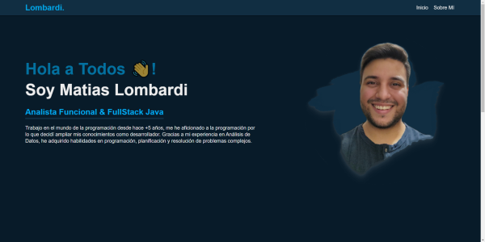

# 01 - Web Personal

***
Projecto de **Frontend Developer** realizado con las tecnologias de **HTML** y **CSS**, herramientas basicas para crear una página web.

## Objetivo

Aplicar los conocimientos adquiridos sobre programación y desarrollo frontend para crear una
página web personal simple utilizando HTML y CSS.

## Consigna

Aplicar los conceptos de programación y desarrollo web que hemos aprendido durante el curso para crear una página web personal simple. Esto nos permitirá reforzar nuestros conocimientos sobre HTML y CSS, así como experimentar con la creación de contenido y el diseño.
