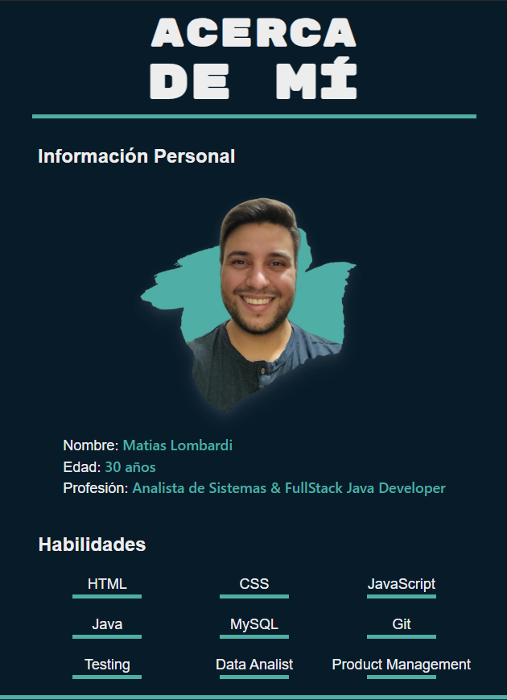

# 02 - Acerca de Mí

***
Projecto de **Frontend Developer** realizado con las tecnologias de **HTML** y **CSS**, herramientas basicas para crear una página web.

## Objetivo

Aplicar los conocimientos adquiridos sobre programación y desarrollo frontend para crear una página web personal simple utilizando HTML y CSS.

## Consigna

Para esta actividad práctica, aplicaremos todo lo que hemos aprendido en la clase 02 para construir nuestra propia página web de 'Acerca de Mí'. Esta página será una forma sencilla pero efectiva de demostrar nuestras habilidades básicas en HTML y CSS. Crearemos una estructura de página clara utilizando etiquetas HTML semánticas y aplicaremos estilos básicos para mejorar la apariencia visual. Además, nos aseguraremos de que nuestra página sea responsiva. Al final de esta actividad, tendrás una página web funcional y un entendimiento sólido de cómo se unen HTML y CSS para crear páginas web.
