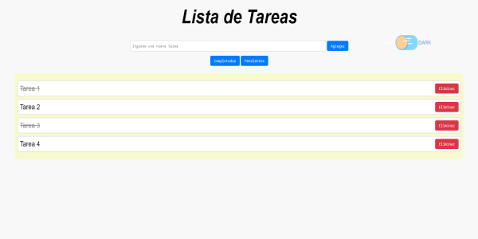

# 03 - Lista de Tareas

***
Projecto de **Frontend Developer** realizado con las tecnologias de **HTML** y **CSS**, herramientas basicas para crear una página web.

## Objetivo

Aplicar los conocimientos adquiridos sobre programación y desarrollo frontend para crear una página simple utilizando HTML, CSS y javascript.

## Consigna

Vamos a trabajar juntos en la creación de una aplicación sencilla de lista de tareas utilizando HTML, CSS y JavaScript. Nuestra aplicación permitirá a los usuarios agregar nuevas tareas, marcarlas como completadas y eliminarlas de la lista.
