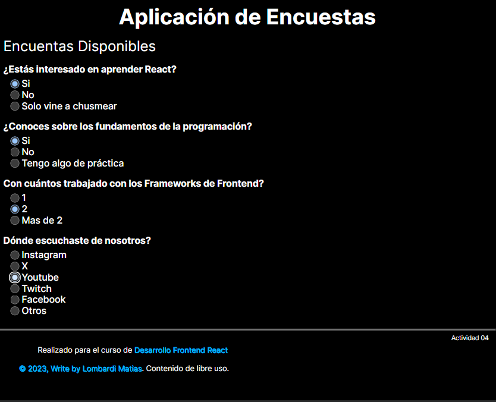

# 04 - Encuesta con React

***
Projecto de **Frontend Developer** realizado con **React**,de manera introductoria.

## Objetivo

En esta actividad el objetivo consiste en crear una aplicación web de encuestas en React que permitirá a los usuarios listar encuestas disponibles. Deberás aplicar conceptos de manejo de estado y componentes en React para construir esta aplicación.

## Consigna

Vamos a trabajar juntos en la creación de una aplicación sencilla de lista de tareas utilizando HTML, CSS y JavaScript. Nuestra aplicación permitirá a los usuarios agregar nuevas tareas, marcarlas como completadas y eliminarlas de la lista.
