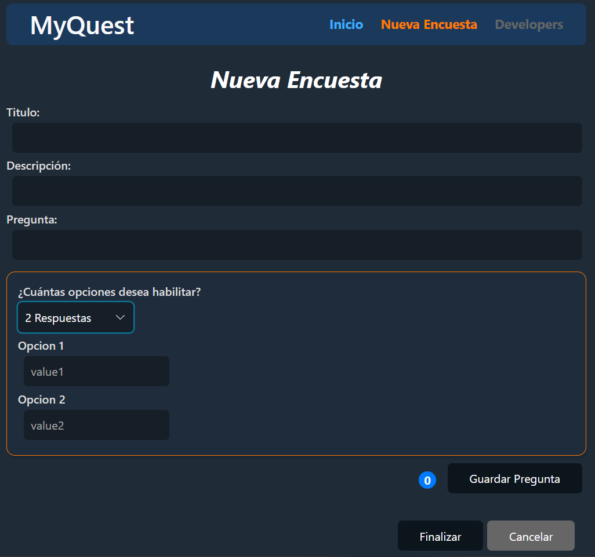

# 06 - Encuesta Avanzada con IA

***
Realizamos el projecto del punto 05 apoyandonos con la **IA Codeium**.

## Objetivo

Los estudiantes desarrollarán una aplicación de encuestas en React, permitiéndoles poner en práctica y consolidar sus conocimientos sobre los fundamentos de React, JSX, componentes, estado, enrutamiento, formularios y estilos.

## Consigna

Desarrollar una aplicación que permita a los usuarios crear encuestas, ver una lista de las encuestas creadas y responder a ellas.

La aplicación debe incluir:

* Una página de inicio con la lista de encuestas disponibles.
* Una página para crear nuevas encuestas.
* Una página para ver una encuesta en particular.
