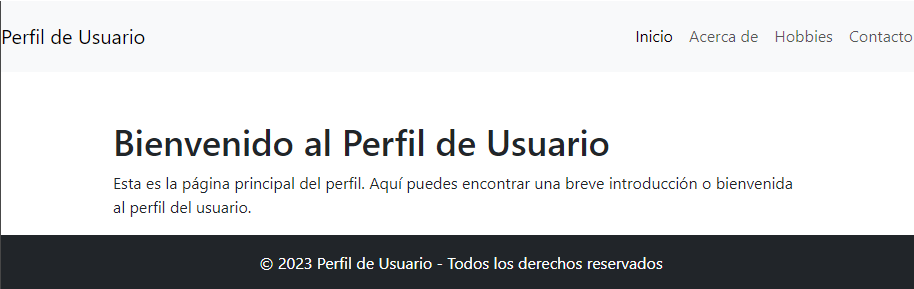

# 07 - Perfil de usuario

***
Desarrollar una aplicación **React** que simule una página de perfil de usuario, utilizando múltiples componentes y navegación con **React Router DOM**. La aplicación debe estar estilizada con **Bootstrap** y finalmente, se desplegará en **Netlify**.

## Link deploy

[Profile-react](https://07-profile-react-deploy.netlify.app/)

[](https://app.netlify.com/sites/07-profile-react-deploy/deploys)



## Objetivo

Construir un perfil de usuario simple utilizando React y estilizarlo con Bootstrap.

## Requisitos

### 1. Componentes Principales

* **Encabezado**: Debe contener el nombre de la aplicación y un menú de navegación.
* **Página Principal (`Home`)**: Una breve introducción o bienvenida al perfil del usuario.
* **Información Personal (`About`)**: Detalles como nombre, edad, ocupación y una breve biografía.
* **Hobbies (`Hobbies`)**: Una lista o galería de hobbies o intereses del usuario.
* **Contacto (`Contact`)**: Un formulario ficticio para contactar al usuario (no es necesario que funcione).

### 2. Navegación

* Implementar React Router DOM para navegar entre los diferentes componentes.
* El menú en el encabezado debe permitir al usuario cambiar entre las páginas principales, información personal, hobbies y contacto.

### 3. Estilización

* Utilizar Bootstrap para estilizar la aplicación, asegurándose de que sea responsiva.

### 4. Despliegue

* La aplicación debe ser desplegada en Netlify.

## Instrucciones

### 1. Crear los componentes

Dentro de la carpeta `src`, crea una carpeta llamada `components`.

* Componente Encabezado (`Header.jsx`)
* Componente Página Principal (`Home.jsx`)
* Componente Información Personal (`About.jsx`)
* Componente Hobbies (`Hobbies.jsx`)
* Componente Contacto (`Contact.jsx`)
* Componente Footer (`Footer.jsx`)
* Archivo `App.js`

### 2.Despliegue en Netlify

Netlify es una plataforma de automatización moderna para el desarrollo web que permite desplegar sitios y aplicaciones web de manera rápida y sencilla. Ofrece características como despliegue continuo desde repositorios git, funciones sin servidor, y mucho más.

Para continuar es necesario crear una cuenta gratuita en [Netlify](https://www.netlify.com/)

1. Instalar Netlify CLI:

Abre una terminal en la carpeta raíz de tu proyecto y ejecuta el siguiente comando para instalar la herramienta netlify-cli, que facilitará el despliegue en Netlify:

```bash
npm install netlify-cli -g
```

2. Modificar scripts en `package.json`:

En package.json, modifica la sección de scripts para actualizar la variable PUBLIC_URL:

```json
"scripts": {
    "build": "PUBLIC_URL= react-scripts build",
    // ...otros comandos...
}
```

3. Ejecuta el despliegue:

Ahora puedes ejecutar el comando para desplegar tu aplicación en Netlify:

```bash
npm run build

netlify deploy
```

Seguir las instrucciones y indicar la carpeta `./build` como fuente para desplegar el sitio. Esto construirá la aplicación y la desplegará.

4. Accede a tu aplicación desplegada:

Una vez que el proceso de despliegue haya finalizado sin errores, puedes acceder a tu aplicación en la URL que indica en el resultado.

5. Actualiza y comparte:

Cada vez que realices cambios en tu aplicación, repite el paso 3 para actualizar la versión desplegada en Netlify.

¡Eso es todo! Tu aplicación React debería estar ahora desplegada en Netlify y accesible en línea.
